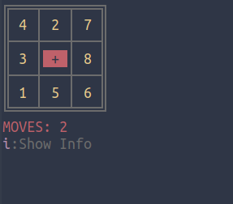

# Nine

**nine** is a tui implementation of the classic 3x3 [sliding-puzzle](https://en.wikipedia.org/wiki/Sliding_puzzle).

{width=200}

There is a 3x3 grid that contains 8 _tiles_, and one position that is _empty_.

{width=100}
{width=100}


The user can move around the 8 tiles on the _only one empty space_, using the navigation keys.


The player in order to win, has to put the numbered tiles in order.

{width=200}


---

## Usage

Through the main menu, the player can:

- Start a new game

{width=200}


- Check Game Statistics

{width=200}

- Configure Game

{width=400}

- Exit nine

{width=100}

---
While playing, the user can:

- Toggle show info, hitting `i`

{width=200}

- Return to the main menu, hitting `q`


---
## Configuring

Either within the game (option `e` of main menu) or just by editing `$HOME/.config/nine/nine.config` file, the user can configure these two parameters:

|n|Variable|Explanation| Acceptable Values|Default Value|
|---|---|---|---|---|
|_1_| CHARACTER_THEME|The characters used in the tiles|letters, numbers|numbers|
|_2_|CURSOR_COLOR|The color of the empty tile |yellow, red, cyan, blue, magenta, gray|red|
|_3_|NOTIFICATION_TOGGLE|Show Notifications while playing|yes / no| yes|
|_4_|CHEATSHEET_TOGGLE|Show keybinding cheatsheet by default (can be also toggled while playing)|yes / no| yes|
|_5_|PREFERRED_EDITOR |Editor to be used to open the config file|Any gui or tui text editor|`$EDITOR`\|\|`nano`|
|_6_|NAVIGATION_KEYS|Keys to navigate in the grid. Arrow keys are hardcoded and work in all options.| vim(`hjkl`), aswd |vim|

If the configuration file in not properly loaded, the game will continue with hardcoded default values.

---

## Install


From a terminal window, clone the repository and change directory to `nine/`

```
git clone https://gitlab.com/christosangel/nine.git&&cd nine/
```

make `install.sh` executable, and run it:

```
chmod +x install.sh&&./install.sh
```


---

### Run

The install script will show you a messege, which will inform you that you can run the script by running:

```
nine.sh
```


or from the same directory:

```
./nine.sh
```

---
***Have fun!***
